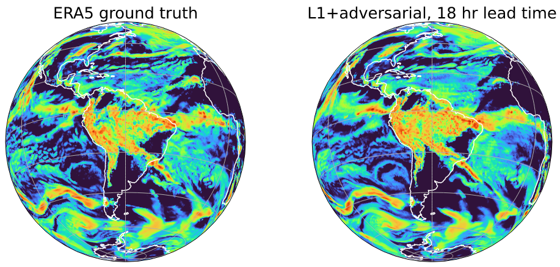

# Generative Modeling of High-resolution Global Precipitation Forecasts



This repo contains code for ["Generative Modeling of High-resolution Global
Precipitation Forecasts"](https://www.climatechange.ai/papers/neurips2022/89).

**Abstract**:

> Forecasting global precipitation patterns and, in particular, extreme
> precipitation events is of critical importance to preparing for and adapting
> to climate change. Making accurate high-resolution precipitation forecasts
> using traditional physical models remains a major challenge in operational
> weather forecasting as they incur substantial computational costs and struggle
> to achieve sufficient forecast skill. Recently, deep-learning-based models
> have shown great promise in closing the gap with numerical weather prediction
> (NWP) models in terms of precipitation forecast skill, opening up exciting new
> avenues for precipitation modeling. However, it is challenging for these deep
> learning models to fully resolve the fine-scale structures of precipitation
> phenomena and adequately characterize the extremes of the long-tailed
> precipitation distribution. In this work, we present several improvements to
> the architecture and training process of a current state-of-the art deep
> learning precipitation model (FourCastNet) using a novel generative
> adversarial network (GAN) to better capture fine scales and extremes. Our
> improvements achieve superior performance in capturing the extreme percentiles
> of global precipitation, while comparable to state-of-the-art NWP models in
> terms of forecast skill at 1-2 day lead times. Together, these improvements
> set a new state-of-the-art in global precipitation forecasting.

# Related work

- FourCastNet: [paper](https://arxiv.org/abs/2202.11214), [repo](https://github.com/NVlabs/FourCastNet)
- TSIT: [paper](https://arxiv.org/abs/2007.12072), [repo](https://github.com/EndlessSora/TSIT)

# Citatation

```r
@inproceedings{duncan2022generative,
  title={Generative Modeling of High-resolution Global Precipitation Forecasts},
  author={Duncan, James and Harrington, Peter  and Subramanian, Shashank},
  booktitle={NeurIPS 2022 Workshop on Tackling Climate Change with Machine Learning},
  url={https://www.climatechange.ai/papers/neurips2022/89},
  year={2022}
}
```
